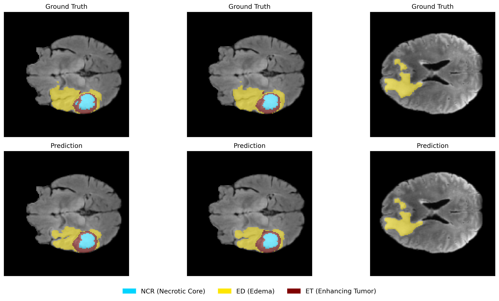

# Automatic Brain Tumor Segmentation using 2D U-Net
 
## Overview 

* [Dataset](#Dataset)
* [Pre-processing](#Pre-processing)
* [Model](#Model)
* [Training](#Training)
* [Results](#Results)

### Dataset
The model is trained and evaluated on the Brain Tumor Segmentation (BraTS) dataset ([here](https://www.synapse.org/Synapse:syn51156910/wiki/627000)). This dataset provides multimodal 3D MRI scans for each patient, including four modalities: T1, T1ce (post-contrast), T2, and FLAIR. The scans are natively skull-stripped, resampled to an isotropic 1mm³ resolution, and co-registered.The ground truth annotations consist of three tumor sub-regions:

### Pre-processing 
Because the network is a 2D architecture, the 3D MRI volumes are sliced axially. To prepare the data for the model
1) **Z-Score Normalization**: Each MRI modality is normalized to zero mean and unit variance. This normalization is only applied to the brain tissue (ignoring the black background).
2) **Patch Extraction**: Slices are cropped/resized to a uniform 128 x 128 dimension.
3) **Background Filtering**: Slices containing only background pixels are discarded to prevent the model from becoming heavily biased toward the background class.

### Model
The network is built upon the foundational 2D U-Net architecture. The model follows a symmetric encoder-decoder structur with 4 downsampling/upsampling levels. The final layer uses a $1 \times 1$ convolution with a Softmax activation function, outputting a (128, 128, 4) tensor that represents the pixel-wise probability distribution across the 4 classes (Background, NCR, ED, ET).

### Training:
The model was trained using a custom Multi-class 2D Dice Loss function. Instead of standard cross-entropy, the custom Dice Loss forces the model to maximize the spatial overlap between the predicted tumor regions and the ground truth. I utilized a patient-level split (e.g., training on the first 500 patients and testing on a strict hold-out set). 

### Results
The performance of the model is measured using the Dice Similarity Coefficient (DSC) on test set (patients 501–610). The metrics are grouped into the standard clinical evaluation regions suggested by BraTS benchmark:

| Region | Mean Dice| Std Dice
| :--- | :--- | :---
| **Tumor Core (TC)** | 0.87 | 0.26
| **Enhancing Tumor (ET)** | 0.84 | 0.25
| **Whole Tumor (WT)** | 0.81 | 0.26

**Attribution:**
*Data used in this project were obtained as part of the Brain Tumor Segmentation (BraTS) Challenge project through Synapse ID: syn51156910.*

